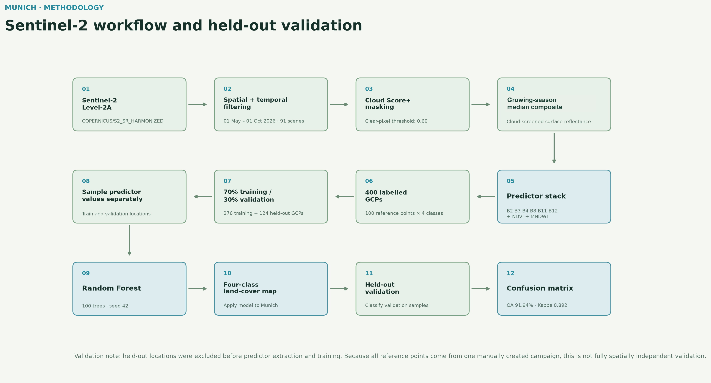
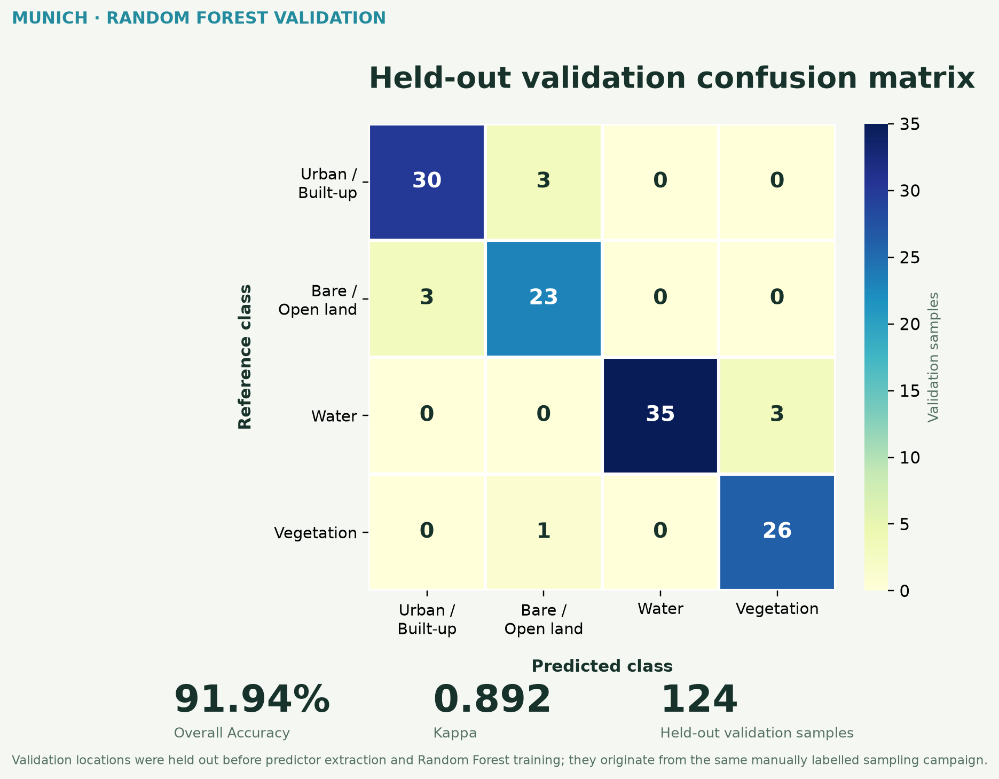
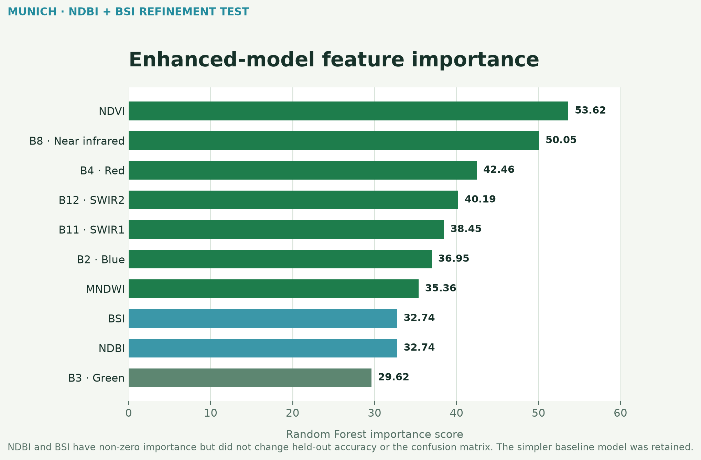
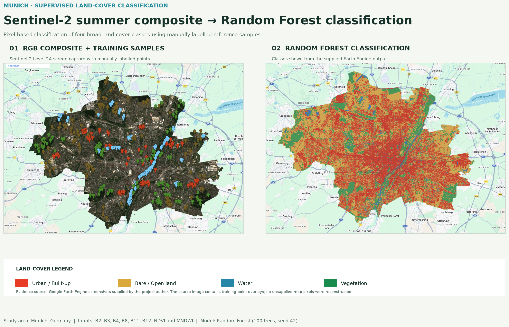

# Supervised Land-Cover Classification of Munich Using Sentinel-2 and Random Forest

## Objective

Build a transparent four-class land-cover classification for Munich, Germany, using Sentinel-2 imagery and a Random Forest classifier. The classes are urban / built-up, bare / open land, water and vegetation.

## Study area and datasets

Munich, Germany. The analysis uses `COPERNICUS/S2_SR_HARMONIZED` Level-2A surface reflectance from May–September 2026. The input collection contains 91 Sentinel-2 scenes before compositing. Google Cloud Score+ masks cloud-affected pixels using a 0.60 clear-pixel threshold before a growing-season median composite is created.

Predictors are B2 (blue), B3 (green), B4 (red), B8 (near infrared), B11 (SWIR1), B12 (SWIR2), NDVI and MNDWI.

## Workflow

1. Filter Sentinel-2 imagery spatially and temporally, then apply Cloud Score+ masking.
2. Build a growing-season median composite and predictor stack.
3. Represent four land-cover classes with 100 manually labelled reference points each.
4. Randomly divide the 400 original reference points into 276 training and 124 validation locations.
5. Extract predictor values separately for the training and validation locations.
6. Train a 100-tree Random Forest on the training samples only and apply it to Munich.
7. Classify the held-out validation samples, then calculate the confusion matrix and accuracy measures.

## Model

- Classifier: Random Forest
- Trees: 100
- Random seed: 42
- Class order: Urban / Built-up, Bare / Open Land, Water, Vegetation

## Held-out validation and key results

The held-out validation confusion matrix contains 124 samples. Rows are reference classes and columns are predicted classes.

| Reference \ Predicted | Urban | Bare / Open Land | Water | Vegetation |
|---|---:|---:|---:|---:|
| Urban / Built-up | 30 | 3 | 0 | 0 |
| Bare / Open Land | 3 | 23 | 0 | 0 |
| Water | 0 | 0 | 35 | 3 |
| Vegetation | 0 | 1 | 0 | 26 |

- Overall Accuracy: **91.94%**
- Kappa: **0.892**

| Class | Producer Accuracy | User Accuracy |
|---|---:|---:|
| Urban / Built-up | 90.9% | 90.9% |
| Bare / Open Land | 88.5% | 85.2% |
| Water | 92.1% | 100.0% |
| Vegetation | 96.3% | 89.7% |

## Model refinement: NDBI + BSI test

To address the main urban–bare / open land confusion, NDBI and BSI were added to an enhanced 10-predictor Random Forest. Both indices received non-zero importance, but held-out validation accuracy and the confusion matrix were identical to the 8-predictor baseline. The simpler baseline model was therefore retained.

| Metric | Baseline | Enhanced |
|---|---:|---:|
| Predictors | 8 | 10 |
| Overall Accuracy | 91.94% | 91.94% |
| Kappa | 0.892 | 0.892 |
| Additional indices | — | NDBI, BSI |
| Out-of-bag error | — | 10.1% |
| Final choice | **Retained ✓** | Not retained |

NDVI was the most important enhanced-model predictor, followed by B8 near infrared. NDBI and BSI received non-zero importance but did not improve held-out performance, suggesting that much of their discriminatory information was already represented by the existing spectral predictors.

## Interpretation

The strongest reciprocal confusion occurs between urban and bare / open land: three urban reference samples were predicted as bare / open land and three bare / open samples as urban. Water and vegetation show stronger separation, although three water validation samples were classified as vegetation. Vegetation has the highest producer accuracy (96.3%), while water has 100% user accuracy in the held-out validation sample. Fine-grained salt-and-pepper variation remains because this is a pixel-based classification without post-classification smoothing.

## Limitations

The reported accuracy is based on a random holdout of the original manually labelled reference points. The validation samples were excluded before predictor extraction and model training. However, because the training and validation locations originate from the same manually created sampling campaign and may be spatially close, the result should not be interpreted as a fully spatially independent accuracy assessment. A production workflow would use geographically independent validation data or external reference imagery.

## Tools

Google Earth Engine, Sentinel-2 Level-2A, Cloud Score+, JavaScript, Random Forest, Python, Matplotlib, NumPy and Pillow.

## Earth Engine source

[Open the Google Earth Engine script](https://code.earthengine.google.com/26b8e77387d61a9c6dbf9fd57404f309)

## Portfolio output

The map imagery in the portfolio figure is cleanly cropped from the supplied Earth Engine screenshots. The RGB panel therefore retains its original training-point overlay; no missing map content has been fabricated.
