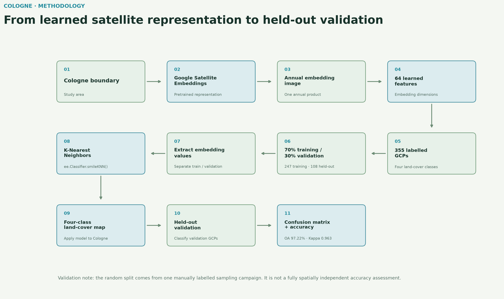
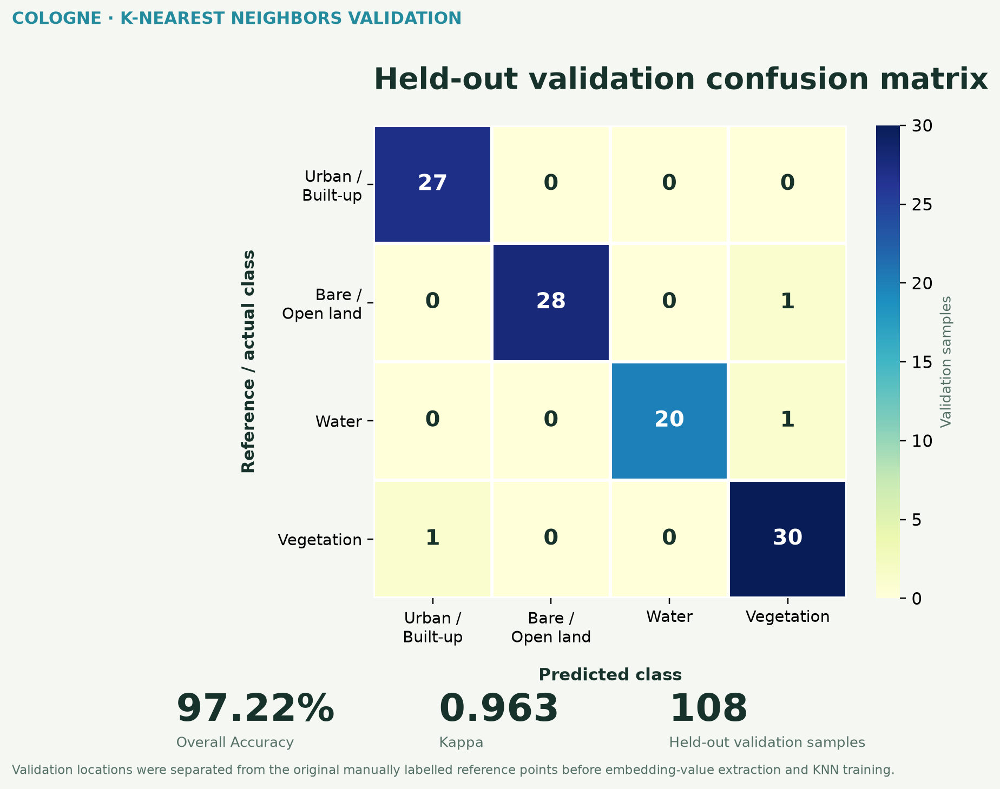
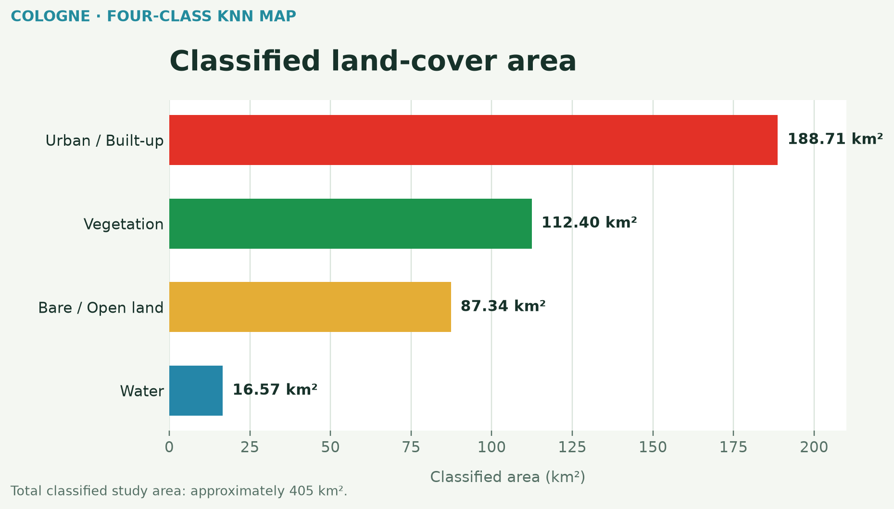

# Land-Cover Classification of Cologne Using Google Satellite Embeddings and K-Nearest Neighbors

## Objective

Evaluate whether pretrained Google Satellite Embeddings can support accurate four-class land-cover classification of Cologne, Germany with a lightweight K-Nearest Neighbors (KNN) classifier.

## Learning attribution

Methodology was informed by Ujaval Gandhi's [Spatial Thoughts End-to-End Google Earth Engine course](https://courses.spatialthoughts.com/end-to-end-gee.html).

## Data and features

- Predictor source: `GOOGLE/SATELLITE_EMBEDDING/V1/ANNUAL`
- One 2025 annual embedding image with 64 learned embedding dimensions
- Sentinel-2 RGB is a visual reference layer only, not the KNN predictor stack
- Classes: Urban / Built-up, Bare / Open Land, Water and Vegetation

## Training and validation

355 manually labelled reference points were split before embedding-value extraction using a reproducible random 70/30 split with seed 42:

- Training GCPs: 247
- Held-out validation GCPs: 108

The classifier was implemented with `ee.Classifier.smileKNN()` using the Earth Engine defaults; no additional KNN hyperparameters were explicitly configured.

## Held-out validation results

| Reference \ Predicted | Urban | Bare / Open | Water | Vegetation |
|---|---:|---:|---:|---:|
| Urban / Built-up | 27 | 0 | 0 | 0 |
| Bare / Open Land | 0 | 28 | 0 | 1 |
| Water | 0 | 0 | 20 | 1 |
| Vegetation | 1 | 0 | 0 | 30 |

- Overall Accuracy: **97.22%**
- Kappa: **0.963**

| Class | Producer Accuracy | User Accuracy |
|---|---:|---:|
| Urban / Built-up | 100.0% | 96.4% |
| Bare / Open Land | 96.6% | 100.0% |
| Water | 95.2% | 100.0% |
| Vegetation | 96.8% | 93.8% |

## Classified area

| Class | Area |
|---|---:|
| Urban / Built-up | 188.71 km² |
| Bare / Open Land | 87.34 km² |
| Water | 16.57 km² |
| Vegetation | 112.40 km² |

Total classified area is approximately 405 km².

## Why embeddings

Each location is represented by a 64-dimensional learned satellite embedding from Google's precomputed annual embedding product. These dimensions are learned features, not individual spectral bands; KNN operates directly on this feature representation.

## Limitations

The validation locations come from the same manually labelled sampling campaign as the training locations and are randomly rather than spatially independently split. The reported result is therefore not a guaranteed map-wide accuracy estimate. KNN performance can also depend on neighbourhood settings and feature-space structure. This is a portfolio and research demonstration, not an authoritative land-cover dataset.

## Tools and source

Google Earth Engine, Google Satellite Embeddings, K-Nearest Neighbors, Sentinel-2 RGB reference, JavaScript, Python and Matplotlib.

[View the Google Earth Engine source](https://code.earthengine.google.com/3fc63598b96d14359a8882c6de49aab7)
